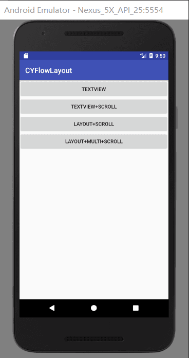
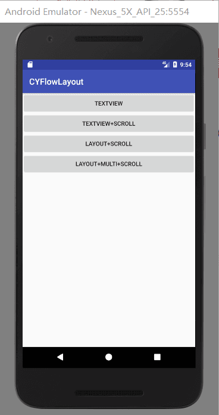

  微信公众号
 

[简书](https://www.jianshu.com/p/a3bdd425317e)

[APK下载](https://github.com/AnJiaoDe/MultiFlowLayout/blob/master/app/build/outputs/apk/app-debug.apk)


**使用方法**

将libray模块复制到项目中,或者直接在build.gradle中依赖:

```
allprojects {
		repositories {
			
			maven { url 'https://jitpack.io' }
		}
	}
```

```
dependencies {
	        compile 'com.github.AnJiaoDe:MultiFlowLayout:V1.1.2'
	}
```

**注意：如果sync报错，是因为和com.android.tools.build:gradle 3.0有关，**
**可以改将compile改为implementation 或者api** 

**1.TextView**



```
<?xml version="1.0" encoding="utf-8"?>
<com.cy.cyflowlayoutlibrary.FlowLayout xmlns:android="http://schemas.android.com/apk/res/android"
    xmlns:tools="http://schemas.android.com/tools"
    xmlns:app="http://schemas.android.com/apk/res-auto"
    android:id="@+id/fl"
    android:layout_width="match_parent"
    app:width_space="10dp"//宽间距
    app:height_space="10dp"//高间距
    android:padding="10dp"
    android:layout_height="400dp">

</com.cy.cyflowlayoutlibrary.FlowLayout>

```

```


public class TVActivity extends BaseActivity {

    private FlowLayoutAdapter<String> flowLayoutAdapter;
    @Override
    protected void onCreate(Bundle savedInstanceState) {
        super.onCreate(savedInstanceState);
        setContentView(R.layout.activity_tv);
        List<String> list=new ArrayList<>();
            list.add("环境");
            list.add("环境");
            list.add("如果皇太后");
            list.add("人皇太后");
            list.add("环境");
            list.add("然后");
            list.add("环境");
            list.add("环境");
            list.add("然后钛合金");
            list.add("环境");
            list.add("任何人挺好");
            list.add("环境");
            list.add("发个黄庭坚");
            list.add("环境");
            list.add("分分然后");
            list.add("环境");
            list.add("环境");
            list.add("凤凰台和");
            list.add("环境");
            list.add("环境");
            list.add("环境");
            list.add("发个荣誉感");
            list.add("环境");
            list.add("复合肥");
            list.add("环境");
            list.add("发然后");
            list.add("环的风格让他很认同和境");
            list.add("的富贵华庭");
            list.add("的富");
        flowLayoutAdapter=new FlowLayoutAdapter<String>(list) {
            @Override
            public void bindDataToView(ViewHolder holder, int position, String bean) {
                holder.setText(R.id.tv,bean);
            }

            @Override
            public void onItemClick(int position, String bean) {

                showToast("点击"+position);
            }

            @Override
            public int getItemLayoutID(int position, String bean) {
                return R.layout.item_tv;
            }
        };
        ((FlowLayout)findViewById(R.id.fl)).setAdapter(flowLayoutAdapter);
    }

    @Override
    public void onClick(View v) {

    }
}

```
**2.TextView+Scroll**



```
<?xml version="1.0" encoding="utf-8"?>
<com.cy.cyflowlayoutlibrary.FlowLayoutScrollView xmlns:android="http://schemas.android.com/apk/res/android"
    xmlns:app="http://schemas.android.com/apk/res-auto"
    xmlns:tools="http://schemas.android.com/tools"
    android:id="@+id/flsv"
    android:layout_width="match_parent"
    android:layout_height="match_parent"
    android:padding="10dp"
    app:height_space="10dp"
    app:width_space="10dp">

</com.cy.cyflowlayoutlibrary.FlowLayoutScrollView>

```

```

public class TVScrollActivity extends BaseActivity {
    private FlowLayoutAdapter<String> flowLayoutAdapter;
    @Override
    protected void onCreate(Bundle savedInstanceState) {
        super.onCreate(savedInstanceState);
        setContentView(R.layout.activity_tvscroll);
        List<String> list=new ArrayList<>();
        list.add("环境");
        list.add("环境");
        list.add("如果皇太后");
        list.add("人皇太后");
        list.add("环境");
        list.add("然后");
        list.add("环境");
        list.add("环境");
        list.add("然后钛合金");
        list.add("环境");
        list.add("任何人挺好");
        list.add("环境");
        list.add("发个黄庭坚");
        list.add("环境");
        list.add("分分然后");
        list.add("环境");
        list.add("环境");
        list.add("凤凰台和");
        list.add("环境");
        list.add("环境");
        list.add("环境");
        list.add("发个荣誉感");
        list.add("环境");
        list.add("复合肥");
        list.add("环境");
        list.add("发然后");
        list.add("环的风格让他很认同和境");
        list.add("的富贵华庭");
        list.add("环境");
        list.add("环境");
        list.add("如果皇太后");
        list.add("人皇太后");
        list.add("环境");
        list.add("然后");
        list.add("环境");
        list.add("环境");
        list.add("然后钛合金");
        list.add("环境");
        list.add("任何人挺好");
        list.add("环境");
        list.add("发个黄庭坚");
        list.add("环境");
        list.add("分分然后");
        list.add("环境");
        list.add("环境");
        list.add("凤凰台和");
        list.add("环境");
        list.add("环境");
        list.add("环境");
        list.add("发个荣誉感");
        list.add("环境");
        list.add("复合肥");
        list.add("环境");
        list.add("发然后");
        list.add("环的风格让他很认同和境");
        list.add("的富贵华庭");
        list.add("环境");
        list.add("环境");
        list.add("如果皇太后");
        list.add("人皇太后");
        list.add("环境");
        list.add("然后");
        list.add("环境");
        list.add("环境");
        list.add("然后钛合金");
        list.add("环境");
        list.add("任何人挺好");
        list.add("环境");
        list.add("发个黄庭坚");
        list.add("环境");
        list.add("分分然后");
        list.add("环境");
        list.add("环境");
        list.add("凤凰台和");
        list.add("环境");
        list.add("环境");
        list.add("环境");
        list.add("发个荣誉感");
        list.add("环境");
        list.add("复合肥");
        list.add("环境");
        list.add("发然后");
        list.add("环的风格让他很认同和境");
        list.add("的富贵华庭");
        flowLayoutAdapter=new FlowLayoutAdapter<String>(list) {
            @Override
            public void bindDataToView(ViewHolder holder, int position, String bean) {
                holder.setText(R.id.tv,bean);
            }

            @Override
            public void onItemClick(int position, String bean) {

                showToast("点击"+position);
            }

            @Override
            public int getItemLayoutID(int position, String bean) {
                return R.layout.item_tv;
            }
        };
        ((FlowLayoutScrollView)findViewById(R.id.flsv)).setAdapter(flowLayoutAdapter);
    }

    @Override
    public void onClick(View v) {

    }
}

```
**3.layout+scroll+remove+add**


```
<?xml version="1.0" encoding="utf-8"?>
<com.cy.cyflowlayoutlibrary.FlowLayoutScrollView xmlns:android="http://schemas.android.com/apk/res/android"
    xmlns:tools="http://schemas.android.com/tools"
    xmlns:app="http://schemas.android.com/apk/res-auto"
    android:id="@+id/flsv"
    android:padding="6dp"
    android:layout_width="match_parent"
    android:layout_height="match_parent">

</com.cy.cyflowlayoutlibrary.FlowLayoutScrollView>

```

```


public class LayoutScrollActivity extends BaseActivity {
    private FlowLayoutAdapter<String> flowLayoutAdapter;

    @Override
    protected void onCreate(Bundle savedInstanceState) {
        super.onCreate(savedInstanceState);
        setContentView(R.layout.activity_layout);

        List<String> list=new ArrayList<>();
        list.add("环境");
        list.add("环境");
        list.add("如果皇太后");
        list.add("人皇太后");
        list.add("环境");
        list.add("然后");
        list.add("环境");
        list.add("环境");
        list.add("然后钛合金");
        list.add("环境");
        list.add("任何人挺好");
        list.add("环境");
        list.add("发个黄庭坚");
        list.add("环境");
        list.add("分分然后");
        list.add("环境");
        list.add("环境");
        list.add("凤凰台和");
        list.add("环境");
        list.add("环境");
        list.add("环境");
        list.add("发个荣誉感");
        list.add("环境");
        list.add("复合肥");
        list.add("环境");
        list.add("发然后");
        list.add("环的风格让他很认同和境");
        list.add("的富贵华庭");
        list.add("环境");
        list.add("环境");
        list.add("如果皇太后");
        list.add("人皇太后");
        list.add("环境");
        list.add("然后");
        list.add("环境");
        list.add("环境");
        list.add("然后钛合金");
        list.add("环境");
        list.add("任何人挺好");
        list.add("环境");
        list.add("发个黄庭坚");
        list.add("环境");
        list.add("分分然后");
        list.add("环境");
        list.add("环境");
        list.add("凤凰台和");
        list.add("环境");
        list.add("环境");
        list.add("环境");
        list.add("发个荣誉感");
        list.add("环境");
        list.add("复合肥");
        list.add("环境");
        list.add("发然后");
        list.add("环的风格让他很认同和境");
        list.add("的富贵华庭");
        list.add("环境");
        list.add("环境");
        list.add("如果皇太后");
        list.add("人皇太后");
        list.add("环境");
        list.add("然后");
        list.add("环境");
        list.add("环境");
        list.add("然后钛合金");
        list.add("环境");
        list.add("任何人挺好");
        list.add("环境");
        list.add("发个黄庭坚");
        list.add("环境");
        list.add("分分然后");
        list.add("环境");
        list.add("环境");
        list.add("凤凰台和");
        list.add("环境");
        list.add("环境");
        list.add("环境");
        list.add("发个荣誉感");
        list.add("环境");
        list.add("复合肥");
        list.add("环境");
        list.add("发然后");
        list.add("环的风格让他很认同和境");
        list.add("的富贵华庭");
        flowLayoutAdapter = new FlowLayoutAdapter<String>(list) {
            @Override
            public void bindDataToView(ViewHolder holder, int position, String bean) {

                holder.setText(R.id.tv,bean);
            }

            @Override
            public void onItemClick(int position, String bean) {

                remove(position);

            }

            @Override
            public int getItemLayoutID(int position, String bean) {
                return R.layout.item_layout;
            }
        };
        ((FlowLayoutScrollView)findViewById(R.id.flsv)).setAdapter(flowLayoutAdapter);
    }

    @Override
    public void onClick(View v) {

    }
}

```

**4.layout+multi+scroll+remove+add**


```
<?xml version="1.0" encoding="utf-8"?>
<com.cy.cyflowlayoutlibrary.FlowLayoutScrollView xmlns:android="http://schemas.android.com/apk/res/android"
    xmlns:tools="http://schemas.android.com/tools"
    xmlns:app="http://schemas.android.com/apk/res-auto"
    android:id="@+id/flsv"
    android:padding="6dp"
    android:layout_width="match_parent"
    android:layout_height="match_parent">

</com.cy.cyflowlayoutlibrary.FlowLayoutScrollView>

```

```

public class LayoutMultiScrollActivity extends BaseActivity {
    private FlowLayoutAdapter<String> flowLayoutAdapter;

    @Override
    protected void onCreate(Bundle savedInstanceState) {
        super.onCreate(savedInstanceState);
        setContentView(R.layout.activity_layout_multi_scroll);

        List<String> list=new ArrayList<>();
        list.add("会囧哥");
        list.add("环境");
        list.add("如果皇太后");
        list.add("人皇太后");
        list.add("环境");
        list.add("然后");
        list.add("环境");
        list.add("环境");
        list.add("然后钛合金");
        list.add("环境");
        list.add("任何人挺好");
        list.add("环境");
        list.add("发个黄庭坚");
        list.add("环境");
        list.add("分分然后");
        list.add("环境");
        list.add("环境");
        list.add("凤凰台和");
        list.add("环境");
        list.add("环境");
        list.add("环境");
        list.add("发个荣誉感");
        list.add("环境");
        list.add("复合肥");
        list.add("环境");
        list.add("发然后");
        list.add("环的风格让他很认同和境");
        list.add("的富贵华庭");
        list.add("环境");
        list.add("环境");
        list.add("如果皇太后");
        list.add("人皇太后");
        list.add("环境");
        list.add("然后");
        list.add("环境");
        list.add("环境");
        list.add("然后钛合金");
        list.add("环境");
        list.add("任何人挺好");
        list.add("环境");
        list.add("发个黄庭坚");
        list.add("环境");
        list.add("分分然后");
        list.add("环境");
        list.add("环境");
        list.add("凤凰台和");
        list.add("环境");
        list.add("环境");
        list.add("环境");
        list.add("发个荣誉感");
        list.add("环境");
        list.add("复合肥");
        list.add("环境");
        list.add("发然后");
        list.add("环的风格让他很认同和境");
        list.add("的富贵华庭");
        list.add("环境");
        list.add("环境");
        list.add("如果皇太后");
        list.add("人皇太后");
        list.add("环境");
        list.add("然后");
        list.add("环境");
        list.add("环境");
        list.add("然后钛合金");
        list.add("环境");
        list.add("任何人挺好");
        list.add("环境");
        list.add("发个黄庭坚");
        list.add("环境");
        list.add("分分然后");
        list.add("环境");
        list.add("环境");
        list.add("凤凰台和");
        list.add("环境");
        list.add("环境");
        list.add("环境");
        list.add("发个荣誉感");
        list.add("环境");
        list.add("复合肥");
        list.add("环境");
        list.add("发然后");
        list.add("环的风格让他很认同和境");
        list.add("的富贵华庭");
        flowLayoutAdapter = new FlowLayoutAdapter<String>(list) {
            @Override
            public void bindDataToView(ViewHolder holder, int position, String bean) {

                holder.setText(R.id.tv,bean);


            }

            @Override
            public void onItemClick(int position, String bean) {

                if (position==0||position==1||position==2){

                    return;
                }
                remove(position);

            }

            @Override
            public int getItemLayoutID(int position, String bean) {
                if (position==0||position==1||position==2){
                    return R.layout.item_layout2;
                }
                return R.layout.item_layout;
            }
        };
        ((FlowLayoutScrollView)findViewById(R.id.flsv)).setAdapter(flowLayoutAdapter);
    }

    @Override
    public void onClick(View v) {

    }
}

```
 **FlowLayoutAdapter:**
 

```


public abstract class FlowLayoutAdapter<T> {
    private OnDataSetChangedListener onDataSetChangedListener;
    private List<T> list_bean;

    public FlowLayoutAdapter( List<T> list_bean) {
        this.list_bean = list_bean;
    }

    public int getCount() {
        return list_bean.size();
    }

    public final View getView(FlowLayout parent, final int position) {

        View view = LayoutInflater.from(parent.getContext()).inflate(getItemLayoutID(position, list_bean.get(position)), parent, false);

        view.setOnClickListener(new View.OnClickListener() {
            @Override
            public void onClick(View v) {
                onItemClick(position, list_bean.get(position));
            }
        });
        view.setOnLongClickListener(new View.OnLongClickListener() {
            @Override
            public boolean onLongClick(View v) {
                onItemLongClick(position,list_bean.get(position));
                return true;
            }
        });
        bindDataToView(new ViewHolder(view), position, list_bean.get(position));
        return view;

    }


    //填充数据
    public abstract void bindDataToView(ViewHolder holder, int position, T bean);
     /*
      ItemView的单击事件

      @param position
     */

    public abstract void onItemClick(int position, T bean);
    public  void onItemLongClick(int position, T bean){}

    /*
        取得ItemView的布局文件
        @return
       */
    public abstract int getItemLayoutID(int position, T bean);


    public void remove(int position) {
        list_bean.remove(position);
        notifyDataSetChanged();
    }

    public void add(T bean) {
        list_bean.add(bean);

        notifyDataSetChanged();
    }
    public void notifyDataSetChanged(){
        if(onDataSetChangedListener!=null){

            onDataSetChangedListener.onDataSetChanged();
        }
    }

    public void addNoNotify(T bean) {
        list_bean.add(bean);
    }

    public void addToHead(T bean) {
        list_bean.add(0, bean);
    }

    public int addAll(List<T> beans) {
        list_bean.addAll(beans);

        notifyDataSetChanged();

        return beans.size();
    }

    public void addAll(Collection<T> c) {
        list_bean.addAll(c);
        notifyDataSetChanged();


    }

    public int clearAddAll(List<T> beans) {
        list_bean.clear();
        list_bean.addAll(beans);

        notifyDataSetChanged();

        return beans.size();
    }

    public void addAllToHead(List<T> beans) {
        list_bean.addAll(0, beans);
        notifyDataSetChanged();

    }

    public void clear() {
        list_bean.clear();
        notifyDataSetChanged();

    }

    public void setOnDataSetChangedListener(OnDataSetChangedListener onDataSetChangedListener) {
        this.onDataSetChangedListener = onDataSetChangedListener;
    }

    public interface OnDataSetChangedListener{
        public void onDataSetChanged();
    }
    public static class ViewHolder {
        private View itemView;
        private SparseArray<View> array_view;

        public ViewHolder(View itemView) {
            this.itemView = itemView;

            array_view = new SparseArray<View>();

        }


        public <T extends View> T getView(int viewId) {

            View view = array_view.get(viewId);
            if (view == null) {
                view = itemView.findViewById(viewId);
                array_view.put(viewId, view);
            }
            return (T) view;
        }


        public ViewHolder setVisible(int res_id) {
            getView(res_id).setVisibility(View.VISIBLE);
            return this;
        }

        public ViewHolder setInVisible(int res_id) {
            getView(res_id).setVisibility(View.INVISIBLE);
            return this;
        }

        public void setViewGone(int res_id) {
            getView(res_id).setVisibility(View.GONE);
        }

        public void setViewVisible(int res_id) {
            getView(res_id).setVisibility(View.VISIBLE);
        }


        public void setText(int tv_id, String text) {
            TextView tv = getView(tv_id);


            tv.setText(nullToString(text));
        }

        public String nullToString(Object object) {
            return object == null ? "" : object.toString();
        }

        public void setPriceText(int tv_id, String text) {
            TextView tv = getView(tv_id);

            tv.setText("¥" + text);
        }

        public void setCountText(int tv_id, String text) {
            TextView tv = getView(tv_id);

            tv.setText("x" + text);
        }

        public void setCountText(int tv_id, int text) {
            TextView tv = getView(tv_id);

            tv.setText("x" + text);
        }

        public void setPriceText(int tv_id, int text) {
            TextView tv = getView(tv_id);

            tv.setText("¥" + text);
        }

        public void setPriceText(int tv_id, float text) {
            TextView tv = getView(tv_id);

            tv.setText("¥" + text);
        }

        public void setText(int tv_id, int text) {
            TextView tv = getView(tv_id);
            tv.setText(String.valueOf(nullToString(text)));
        }

        public void setTextColor(int tv_id, int color) {
            TextView tv = getView(tv_id);
            tv.setTextColor(color);
        }

        public String getTVText(int tv_id) {
            TextView tv = getView(tv_id);
            return tv.getText().toString().trim();
        }

        public String getETText(int tv_id) {
            EditText tv = getView(tv_id);
            return tv.getText().toString().trim();
        }

        public void setBackgroundResource(int v_id, int resid) {
            View view = getView(v_id);
            view.setBackgroundResource(resid);
        }

        public void setImageBitmap(int v_id, Bitmap bitmap) {
            ImageView view = getView(v_id);
            view.setImageBitmap(bitmap);
        }

        public void setImageResource(int v_id, int resID) {
            ImageView view = getView(v_id);
            view.setImageResource(resID);
        }

        public void setProgress(int progress_id, int progress) {
            ProgressBar progressBar = getView(progress_id);
            progressBar.setProgress(progress);

        }

        public void setOnClickListener(int res_id, View.OnClickListener onClickListener) {
            getView(res_id).setOnClickListener(onClickListener);
        }

        public void setOnLongClickListener(int res_id, View.OnLongClickListener onLongClickListener) {
            getView(res_id).setOnLongClickListener(onLongClickListener);
        }
    }


}

```

 
 
 
  **更新日志**
 
 *V1.1.1*
  - Android 流式布局FlowLayout(搜索历史),可多布局、点击删除、添加等操作，暂无类似RecyclerView布局复用的处理，所以数据不应添加过多
  
  

**License**

 Copyright [AnJiaoDe] [name of copyright owner]

   Licensed under the Apache License, Version 2.0 (the "License");
   you may not use this file except in compliance with the License.
   You may obtain a copy of the License at

       http://www.apache.org/licenses/LICENSE-2.0

   Unless required by applicable law or agreed to in writing, software
   distributed under the License is distributed on an "AS IS" BASIS,
   WITHOUT WARRANTIES OR CONDITIONS OF ANY KIND, either express or implied.
   See the License for the specific language governing permissions and
   limitations under the License.
   
   [GitHub](https://github.com/AnJiaoDe)

关注专题[Android开发常用开源库](https://www.jianshu.com/c/3ff4b3951dc5)

[简书](https://www.jianshu.com/u/b8159d455c69)

 微信公众号
 

QQ群


 
